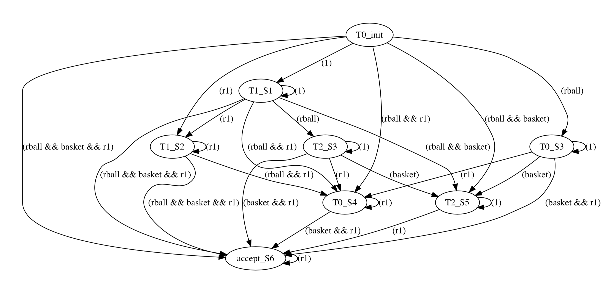
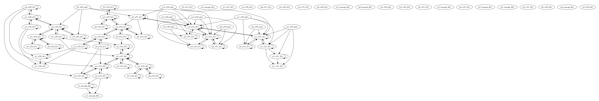

# LTL2FullProd
This project aims to fix a common flaw in existing MATLAB ltl2ba(Linear Temporal Logic(LTL) to Büchi Automaton(BA)) packages where incorrect BA will be produced if the input LTL contains the logical connector not(aka. “¬”). All the works had been done in Python for now and will be moving to MATLAB soon.

## To begin with
--------
The following script is a minimal example using the package.

```python
from full_prod import *
from buchi import buchi_from_ltl

#define region
r4 = Region((0,2),['basket'],'r4')
r5 = Region((1,2),['rball'],'r5')
r6 = Region((2,2),[],'r6')
c1 = Region((0,1),[],'c1')
c2 = Region((1,1),[],'c2')
c3 = Region((2,1),[],'c3')
r1 = Region((0,0),[],'r1')
r2 = Region((1,0),['basket'],'r2')
r3 = Region((2,0),['gball'],'r3')

region_list = [r1, r2, r3, r4, r5, r6, c1, c2, c3]

wfts = wFTS()

for i in region_list:
    wfts.add_states(i)
    
wfts.add_transition(r1,c1,1)
wfts.add_transition(c1,c2,1)
wfts.add_transition(c1,r4,1)
wfts.add_transition(c2,c3,1)
wfts.add_transition(c2,r2,1)
wfts.add_transition(c2,r5,1)
wfts.add_transition(c3,r6,1)
wfts.add_transition(c3,r3,1)

wfts.add_initial(r1)

#convert ltl formula to buchi automaton
formula = '<>(rball && <>basket) && <>[]r1'
buchi = buchi_from_ltl(formula,None)
my_buchi = Buchi_Automaton(buchi)

full_prod = FullProd(wfts,my_buchi)
full_prod.construct_fullproduct()

#plan synthesize
opt=search_opt_run(full_prod)
print 'Plan synthesized:'+str([opt[0][i][0] for i in range(len(opt[0]))])

```


## Plot Buchi and Product Automaton
--------
This package allows you to plot the Buchi and Product Automaton as a graph, which is helpful for debugging.

<table align="center">
  <tr>
    <td>  </td>

  </tr>
</table>

<table align="center">
  <tr>
    <td>  </td>
  </tr>
</table>
The following is a demo of plotting:
```python
#plot buchi
my_buchi.plot()

#plot full product
full_prod_graph = full_prod.return_graph()
plot(full_prod_graph,'full_prod')
```

